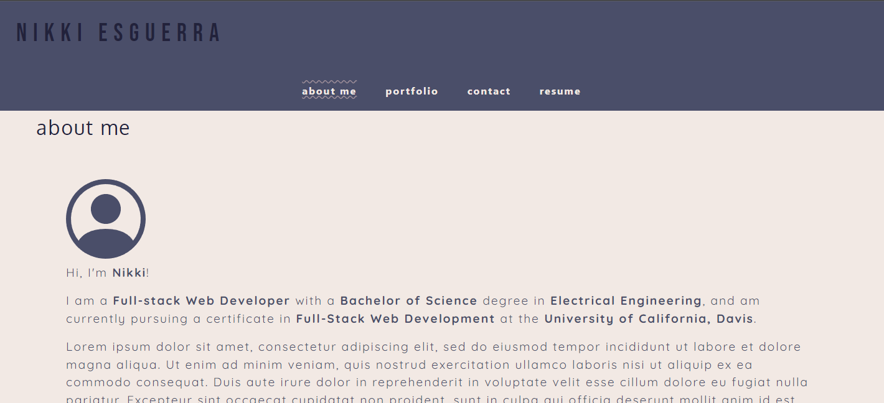
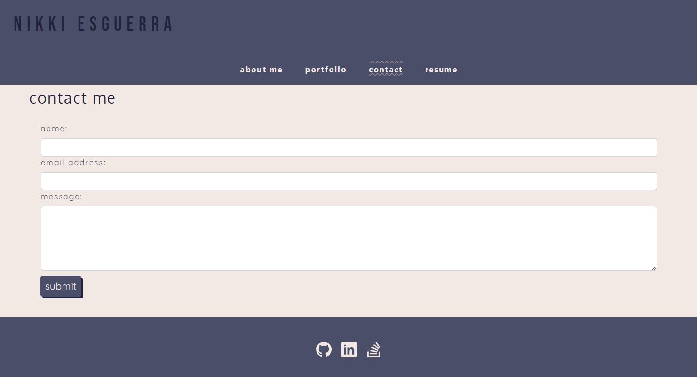

# Module #20 Challenge: React Portfolio

## Description

This project is a **professional portfolio website** made with **React** and is deployed to GitHub Pages. It is a single-page application made from scratch that showcases work samples.

Through this project, I learned how to:

* create React components
* add conditional rendering
* add a contact form
* deploy a React project to GitHub pages

[Check out the deployed application here!](https://desguerra.github.io/react-portfolio-demo/)

## Table of Contents

* [Screenshots](#screenshots)
* [Questions](#questions)

## Screenshots

## Questions

If you have any questions about this repository, please open an issue. You can also find more of my work at [desguerra](https://github.com/desguerra) on GitHub.